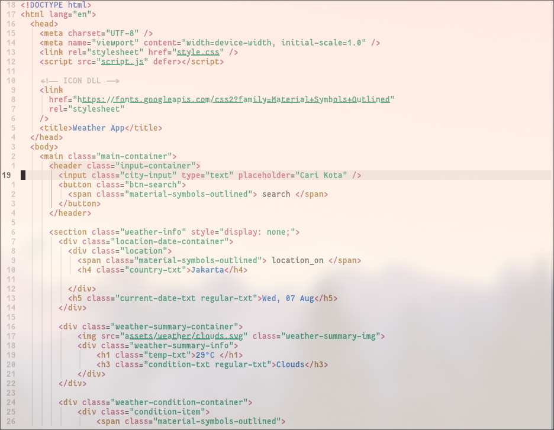
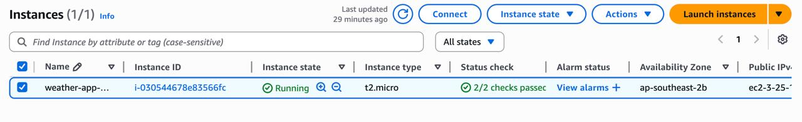
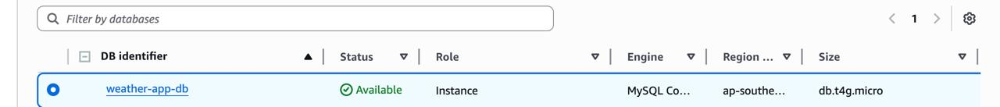
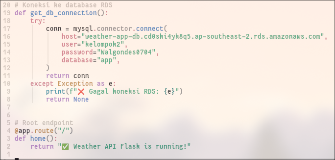
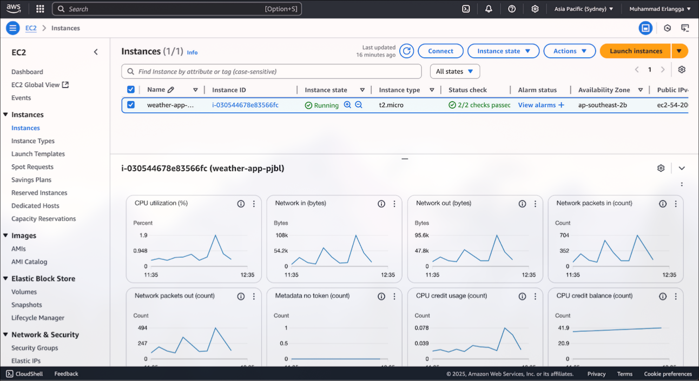

# Finale Project Cloud Computing

    <a href="https://docs.google.com/document/d/1-E_JjysibYCLHvg31IF_ZUP5xFzLmM0nlyJYOrQ7xWY/edit?tab=t.0">Laporan</a>

## File Utama
- Folder frontend: berisikan script pembuatan website
- Folder pyscript: berisikan script python untuk melakukan running 

## Kontributor
- Amellia Harmaimun Hidayah (23083010034)
- Diana Novitasari (23083010014)
- Muhammad Erlangga Kurniawan (23083010045)
- M.C. Raka Anugerah (23083010070)
- M. Nurhadyatullah Kusharyadi (23083010049)

# Fase Pengerjaan
## Fase 1: Pembuatan Frontend dan Backend Aplikasi
pembuatan Frontend dan juga Backend dari aplikasi dapat dilihat di folder frontend dimana kita membuat index.html sebagai html utama kita dan juga style.css sebagai tempat script css kita dan kita juga akan menggunakan script.js untuk membangun backend kita
disini kita juga menggunakan icon secara global dengan menggunakan google api material symbol dan juga font dari google fonts

## Fase 2 Pembangunan RDS dan server EC2:
setelah kita membuat akun AWS Educate, langkah berikutnya adalah untuk membuat server di EC2, hal tersebut dapat dilihat dari gambar di bawah berikut

 
setelah kita membangun server di EC2, kemudian kita akan melakukan setup untuk membuat databases di Amazon RDS, hal tersebut dapat dilihat di gambar di bawah

## Fase 3 Koneksi pada Databases:
kemudian setelah databases dan server telah berjalan, kita dapat melanjutkan pada pengetesan koneksi pada python disini kita menggunakan library flask sebagai library utama untuk melakukan koneksi pada databases tersebut. uji script tersebut dapat dilihat dari python script di bawah berikut

 
output dari kodingan tersebut adalah kita tersambung dengan server tersebut

 
dan ketika kita menyambungkan pada server local tersebut, maka kita akan mendapatkan hasil web yang sebelumnya telah kita bangun

## Fase 4 Cloudwatch Monitoring:
setelah aplikasi kita telah berjalan dengan sukses tentu kita dapat melakukan monitoring dengan menggunakan Amazon CloudWatch. hasil monitoring dari Cloudwatch dapat dilihat sebagai berikut

#### untuk penggunaan secara keseluruhan

#### untuk penggunaan Cpu

## Fase 5 Presentasi
setelah itu kita melakukan presentasi secara daring dan juga melakukan dokumentasi

    <a href="https://youtu.be/Vhb71u5W2qw?si=n_8cLdYeijtEh1lb">Link Presentasi</a>

## Hasil utama
hasil dari running Aplikasi berikut adalah sebagai berikut:
### Laman Utama

### Hasil ketika melakukan Searching pada kota Surabaya:

### Hasil running script python:

